# NeedTracker — Testing Mind Map

This document provides a comprehensive mind map and strategy for testing the **NeedTracker (Rebuild Man)** full-stack application. It is designed to ensure maximum coverage across backend logic, frontend flows, AI pipelines, database constraints, and deployment integrity.

---

## 🗺️ Visual Mind Map (Mermaid.js)

The diagram below represents the core testing vectors of the system. You can view this directly in any markdown viewer supporting Mermaid (such as VS Code, GitHub, or Notion).

```mermaid
graph TD
    %% Styling definitions for a premium theme
    classDef default fill:#232530,stroke:#3b3f51,stroke-width:1px,color:#cad3f5;
    classDef root fill:#ef9f76,stroke:#ee99a0,stroke-width:2px,color:#1e2030,font-weight:bold;
    classDef module fill:#8caaee,stroke:#babbf1,stroke-width:2px,color:#1e2030,font-weight:bold;
    classDef subtopic fill:#eed49f,stroke:#f5a97f,stroke-width:1px,color:#1e2030,font-weight:bold;
    classDef testcase fill:#a6da95,stroke:#8bd5ca,stroke-width:1px,color:#181926;

    %% Central Node
    Root["NeedTracker Test Plan"]:::root

    %% Main Branches
    Root --> Auth["1. Authentication & RBAC"]:::module
    Root --> OrgNeed["2. Org & Need Management"]:::module
    Root --> AdminAppr["3. Registration Approval"]:::module
    Root --> AIOCR["4. AI & OCR PDF Pipeline"]:::module
    Root --> Donation["5. Donation Lifecycle"]:::module
    Root --> NonFunc["6. DevOps & Non-Functional"]:::module

    %% 1. Auth & RBAC
    Auth --> JWT["JWT token lifecycle"]:::subtopic
    Auth --> Roles["3-Tier Permissions"]:::subtopic
    Auth --> AuthFlows["Auth Features"]:::subtopic

    JWT --> JWT1["Token generation on login"]:::testcase
    JWT --> JWT2["Auto-refresh on 401 response"]:::testcase
    JWT --> JWT3["Token expiry & logout"]:::testcase

    Roles --> Roles1["ADMIN: Global control"]:::testcase
    Roles --> Roles2["ORG_ADMIN: Read/Write own Org"]:::testcase
    Roles --> Roles3["DONOR: Read & Pledge access"]:::testcase

    AuthFlows --> AF1["Login via Username/Email"]:::testcase
    AuthFlows --> AF2["Email Password Reset (1h expiry)"]:::testcase
    AuthFlows --> AF3["Invite Co-Admin via token"]:::testcase

    %% 2. Org & Need Management
    OrgNeed --> OrgCRUD["Organisation CRUD"]:::subtopic
    OrgNeed --> SectionCRUD["Section CRUD"]:::subtopic
    OrgNeed --> Needs["Need Tracker"]:::subtopic

    OrgCRUD --> OC1["Geo-coordinates mapping"]:::testcase
    OrgCRUD --> OC2["District validation (Sri Lanka)"]:::testcase
    OrgCRUD --> OC3["Logo / Contact info storage"]:::testcase

    SectionCRUD --> SC1["Head of Section assignment"]:::testcase
    SectionCRUD --> SC2["Deletion cascade validation"]:::testcase

    Needs --> N1["Priority: Critical/Essential/Nice"]:::testcase
    Needs --> N2["Unit types: Box, Unit, Kg, Liter"]:::testcase
    Needs --> N3["Quantity received vs required"]:::testcase
    Needs --> N4["Hierarchy API (Org -> Sec -> Need)"]:::testcase

    %% 3. Registration Approval
    AdminAppr --> Workflow["Workflow Transitions"]:::subtopic
    AdminAppr --> ApprEmail["Notifications"]:::subtopic

    Workflow --> W1["PENDING status on registration"]:::testcase
    Workflow --> W2["ADMIN action: APPROVE -> Activate account"]:::testcase
    Workflow --> W3["ADMIN action: REJECT -> Reason + Cleanup"]:::testcase

    ApprEmail --> E1["SMTP verification on approve"]:::testcase
    ApprEmail --> E2["Rejection explanation mailer"]:::testcase

    %% 4. AI & OCR PDF Pipeline
    AIOCR --> Upload["File Input"]:::subtopic
    AIOCR --> Pipeline["Extraction Engine"]:::subtopic
    AIOCR --> Stage["Review & Approval"]:::subtopic

    Upload --> UP1["PDF extension check"]:::testcase
    Upload --> UP2["File size limits (<10MB)"]:::testcase

    Pipeline --> P1["PyTesseract text extraction"]:::testcase
    Pipeline --> P2["Gemini AI prompt structured parse"]:::testcase
    Pipeline --> P3["Error states on corrupt files"]:::testcase

    Stage --> S1["Extracted staging review screen"]:::testcase
    Stage --> S2["Staged items commit to active Needs"]:::testcase

    %% 5. Donation Lifecycle
    Donation --> DFlow["Donor Flows"]:::subtopic
    Donation --> DStatus["Status Lifecycle"]:::testcase
    Donation --> DLetter["Donation Verification"]:::testcase

    DFlow --> DF1["Private vs Gov donor forms"]:::testcase
    DFlow --> DF2["Anonymised public activity feed"]:::testcase

    DStatus --> DS1["PENDING -> CONFIRMED -> FULFILLED"]:::testcase
    DStatus --> DS2["Donation split on partial confirm"]:::testcase
    DStatus --> DS3["Cancel with reason (restore surplus)"]:::testcase

    DLetter --> DL1["Verification document upload"]:::testcase
    DLetter --> DL2["PDF/Image format restrictions"]:::testcase

    %% 6. DevOps & Non-Functional
    NonFunc --> CI["CI/CD Validation"]:::subtopic
    NonFunc --> Perf["Performance & Metrics"]:::subtopic
    NonFunc --> UX["UX & Responsiveness"]:::subtopic

    CI --> CI1["GitHub Actions lint & test stage"]:::testcase
    CI --> CI2["Trivy Docker vulnerability scanning"]:::testcase
    CI --> CI3["K8s rolling deploy (zero downtime)"]:::testcase

    Perf --> PM1["Prometheus endpoint (/metrics)"]:::testcase
    PM1 --> PM2["Grafana DB/HTTP metrics dashboard"]:::testcase

    UX --> UX1["Mobile-friendly responsive UI"]:::testcase
    UX --> UX2["API query speed & pagination"]:::testcase
```



---

## 📝 Markdown Hierarchical List (Markmap Ready)

The nested list below is fully compatible with **Markmap**. If you copy this list into any Markmap tool, it generates an interactive, dynamic, zoomable mind map.

- **NeedTracker Test Suite**
  - **1. Authentication & Role-Based Access Control (RBAC)**
    - *JWT Tokens*
      - Check token payload contains user role (ADMIN, ORG_ADMIN, DONOR)
      - Verify authentication token generates on login
      - Confirm token auto-refresh on 401 HTTP response
      - Test token expiry and local storage clearing
    - *Route Guards*
      - Next.js client-side route protection (guest vs admin vs donor pages)
      - Django REST Framework view-level permissions (`IsAuthenticated`, custom role permissions)
    - *Password & Invitations*
      - Send secure password reset link (1-hour expiry)
      - Co-admin invitation workflow (link token validation, profile completion)
  - **2. Organisation & Need Management**
    - *Organisation Profile*
      - Validation of registration fields (address, SL-districts, org type)
      - Coordinate validation (latitude/longitude boundaries)
    - *Section Management*
      - Add sections per organisation
      - Assign Head of Section metadata
      - Verify cascade deletion behavior (deleting section cleans up its needs)
    - *Need Items*
      - Enforce priority constraints (CRITICAL, ESSENTIAL, NICE TO HAVE)
      - Check valid unit options (BOX, UNIT, KG, LITER)
      - Validate arithmetic: quantity required vs received
      - Verify Hierarchy API returns complete nested JSON tree
  - **3. Registration Approval Workflow**
    - *Registration Lifecycle*
      - Registrations start in `PENDING` state and are disabled
      - Superadmin Approve -> switches to `APPROVED`, sends email
      - Superadmin Reject -> deletes account, logs reason, sends email
    - *SMTP Email Dispatch*
      - Verify email template contains login link and credential details
      - Error handling for invalid SMTP config
  - **4. AI-Powered PDF & OCR Pipeline**
    - *File Upload Validation*
      - Restrict uploads to `.pdf` formats
      - File size limits validation
    - *Processing Pipeline*
      - Tesseract OCR validation (extract raw text)
      - Google Gemini API key validation & prompt accuracy
      - Structured JSON parsing validation from Gemini
      - Handle API rate limit exceptions gracefully
    - *Review & Staging*
      - Display extracted list in staging layout
      - Superadmin approval of staged items to populate active Needs database
  - **5. Donation Lifecycle & Split Engine**
    - *Donor Classification*
      - Private Donor flow validation (phone, email, name)
      - Government Donor flow validation (dept, designation, reference number)
    - *Lifecycle States*
      - `PENDING` -> `CONFIRMED` -> `FULFILLED` / `CANCELLED`
      - Auto-update of `quantity_received` on `FULFILLED`
    - *Splitting Logic (Critical Core Test)*
      - Confirm partial quantity -> splits original record & marks remainder as `CANCELLED` (surplus)
      - Verify cancelled donation reason logs correctly
      - Test cancellation restores surplus logic (if applicable)
    - *Verification Letters*
      - File upload for confirmation letters (PDF/Image)
  - **6. DevOps, Monitoring & Non-Functional**
    - *CI/CD & Security*
      - Trivy scanner code and image vulnerability verification
      - Kubernetes manifest validation (secrets mapping, replica sets)
    - *Telemetry*
      - Verify `/metrics` parses HTTP latency & database query execution
      - Grafana scraping validation
    - *Performance & Layout*
      - Mobile responsive page layouts (mobile viewports)
      - Search query parameters pagination testing (`limit`, `offset`)

---

## 🛠️ How to Create and View This Mind Map

You can render and manipulate this mind map using several methods:

### Method 1: Using VS Code Extensions (Recommended)
1. Install the **Markmap** extension in VS Code.
2. Open this markdown file in VS Code.
3. Click the **Open as Markmap** button (an icon with circles and branches in the top-right corner of the editor).
4. You will see an interactive, responsive graphical mind map that you can drag, scroll, zoom, and expand/collapse.

### Method 2: Web-Based Live Viewers
* **For the Interactive Mind Map**: Copy the markdown list section above and paste it into [Markmap Online REPL](https://markmap.js.org/repl).
* **For the Flowchart**: Copy the Mermaid block and paste it into [Mermaid Live Editor](https://mermaid.live).

---

## 🏃 Running Existing Tests in the Codebase

You can run the existing automated test suites covering these features:

### 1. Run Django Backend Unit & Integration Tests
Inside the `backend/` directory with your virtual environment activated, run:
```bash
python manage.py test core
```
*This executes unit tests covering permissions, donation splits, geocoding, and administration workflows.*

### 2. Run the AI Document Processing Pipeline Simulation
This runs an end-to-end local integration test verifying server connection, authentication, and the PDF extraction flow:
```bash
python test_document_processing.py
```
*(Requires the Django server to be running locally via `python manage.py runserver`)*
